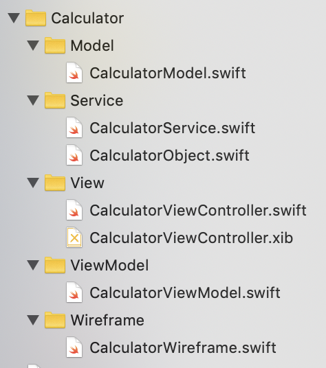
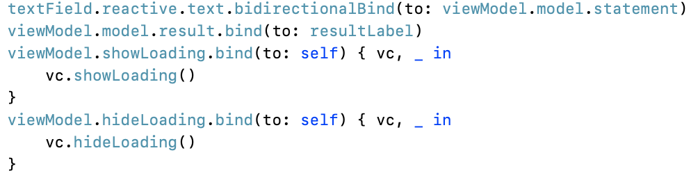
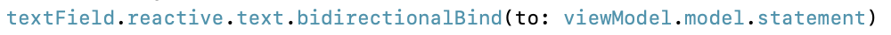
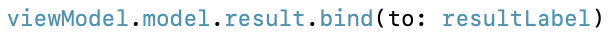
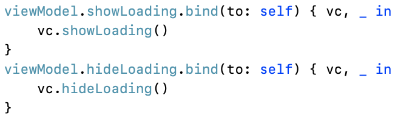
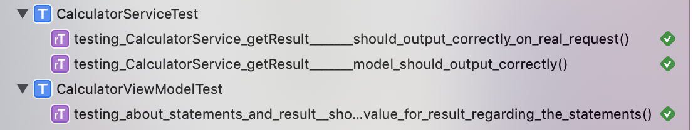
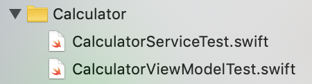
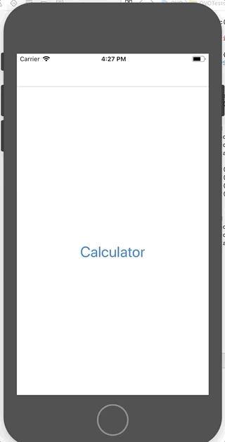

# Auto Calculate Math Statement

Sample project of iOS

## A. Using MVVM:
- With `Wireframe` for navigating from / to a screen
- With `Service` for all request used in a screen

## B. Using `Bond` for Binding (https://github.com/DeclarativeHub/Bond)

## C. Supported by API of MathJS (https://api.mathjs.org)

## D. Current project is using One-Way and Two-Ways Binding, binding placed in View:
1. Main binding

2. Two-Ways Binding

a. `textField` in `"View"` change `statement` in `"ViewModel"`:

So, everytime user typing in the `textField`, the value of `statement` in `"ViewModel"` also changed

b. `statement` in `"ViewModel"` also change `textField` in `"View"`:

So, everytime user click the button `"CLEAR"`, it trigger function `reset()` in `"ViewModel"`. This function clear the `statement` in `"ViewModel"`, and also change the `textField` in `"View"`

3. One-Way Binding

a. `result` in ViewModel change `resultLabel` in View:

4. Example of using signal to trigger loading in `"View"` from `"ViewModel"`

## E. Contain Unit Tests:
- Using `Quick-Nimble` (https://github.com/Quick/Nimble)
- Using `OHTTPStubs` (https://github.com/AliSoftware/OHHTTPStubs)
- Unit Test showcase 

## F. Demo:

---
Special thanks to [@ivanrein](https://github.com/ivanrein), [@romin991](https://github.com/romin991), and [@osdudutz](https://github.com/osdudutz)

---
