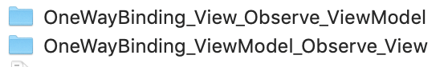

# Auto Calculate Math Statement

Sample project of iOS
1. Using MVVM:
- With `Wireframe` for navigating from / to a screen
- With `Service` for all request used in a screen
2. Using Bond (https://github.com/DeclarativeHub/Bond)
3. Supported by API of MathJS (https://api.mathjs.org)
4. Currently there are 2 mode of binding:
- One Way Binding: View observe ViewModel
- One Way Binding: ViewModel observe View

5. Next project: Two Way Binding's sample

Demo:

Main structures:

