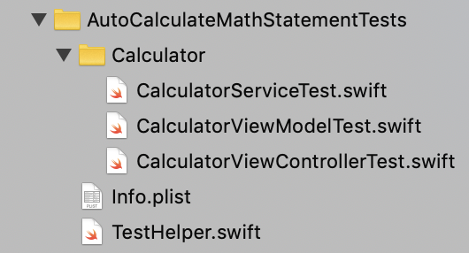

# Auto Calculate Math Statement

Sample project of iOS

1. Using MVVM:
- With `Wireframe` for navigating from / to a screen
- With `Service` for all request used in a screen

2. Using Bond (https://github.com/DeclarativeHub/Bond)

3. Supported by API of MathJS (https://api.mathjs.org)

4. Currently there are 2 mode of Two Way Binding:

- Binding placed on View
- Binding placed on ViewModel

5. Contain Unit Tests:
- Using Quick-Nimble (https://github.com/Quick/Nimble)
- Using OHTTPStubs (https://github.com/AliSoftware/OHHTTPStubs)
- Unit Test showcase 

6. Demo:

---
Special thanks to [@ivanrein](https://github.com/ivanrein) and [@romin991](https://github.com/romin991)

---
Next project: One Way Binding's sample
