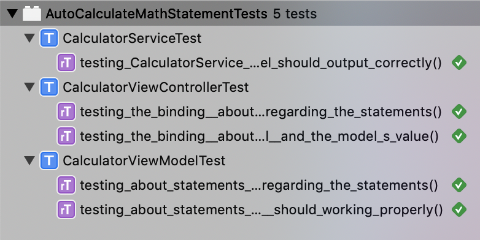
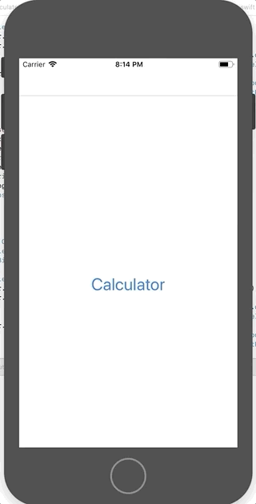

# Auto Calculate Math Statement

Sample project of iOS

1. Using MVVM:
- With `Wireframe` for navigating from / to a screen
- With `Service` for all request used in a screen

2. Using `Bond` (https://github.com/DeclarativeHub/Bond)

3. Supported by API of MathJS (https://api.mathjs.org)

4. Current project is using One-Way and Two-Ways Binding, binding placed in View:
- Main binding

- Two-Ways Binding
-> `textField` in View change `statement` in ViewModel:

-> `statement` in ViewModel also change `textField` in View: 

- One-Way Binding
-> `result` in ViewModel change `resultLabel` in View:

5. Contain Unit Tests:
- Using `Quick-Nimble` (https://github.com/Quick/Nimble)
- Using `OHTTPStubs` (https://github.com/AliSoftware/OHHTTPStubs)
- Unit Test showcase 

6. Demo:

---
Special thanks to [@ivanrein](https://github.com/ivanrein) and [@romin991](https://github.com/romin991)

---
